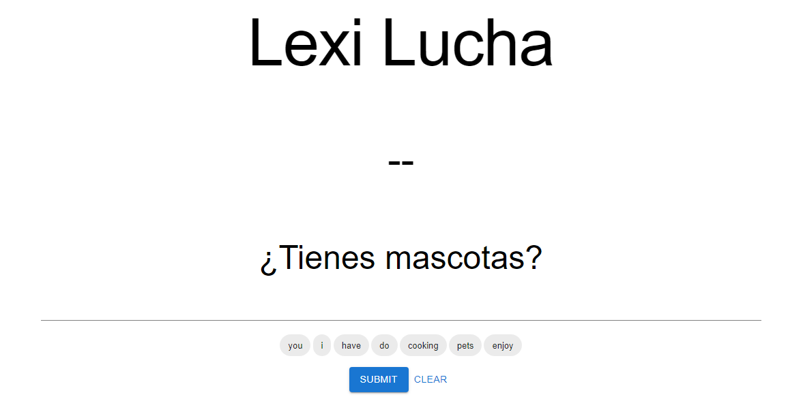

# Readme

### About the project

LexiLucha, a platform where users can hone their Language Other Than English (LOTE) skills, emerged as a dynamic space where individuals can engage in friendly competitions with their peers. Leveraging real-time communication enabled by sockets, users can race against each other to translate simple phrases and questions from languages such as Spanish, German, and Vietnamese. This project not only served as a playground for learning but also as a practical application of these technologies in a meaningful and engaging context.

### Why did I make it

I embarked on this web development project with the primary goal of delving into new tools and technologies within the realm of web development, notably Socket.IO and TypeScript. However, throughout the journey, I found myself immersing in a plethora of other technologies, including Kotlin, GitHub Actions, Docker, Framer Motion, and Material-UI. Of course there were some tools that I have allready used plenty, but could refresh my skills on such as MySQL and SpringBoot.

## The timeline of the project

### The beggining

My primary goal of this project was to improve my React and front-end skills. I wanted to create a project with a functional and easy-to-use UI. The first page I created was the main game page, where the site gives you a phrase and you are provided with a number of words to choose from to translate the phrase.

I aimed for the page to be intuitive so that users would not need a guide or tutorial to figure out how to use it. I had some friends and family test the interface locally, and people were generally fans, which was exciting!

### Creating the prototype

The next major goal was to finish the main game loop that I had in my head, which included being able to choose a language, join a game, and finish a game (seeing a leaderboard update along the way).

With the main game loop ready, I wanted to deploy the project so that I could share it with people around me and start collecting feedback. But I didn’t want to hastily throw together a manual deployment like I had done in the past, so I took a little detour from my development journey.

At this point, all I knew about DevOps was a little bit of Docker. Armed with this knowledge, I started by creating a Docker container for each of my services (React frontend, Spring backend, MySQL database) and then a Docker Compose file to tie them all together.

Once I had the compose working locally, I set up a GitHub Actions workflow to take my main branch and deploy it to my personal homelab. After adding some (very frustrating) configuration to my reverse proxy server, it was all working. This may seem like a short couple of paragraphs, but it actually took many hours. Back to development!

One major benefit of having deployed the application is that I was now able to distribute the prototype to my friends and family and collect feedback. This was important given the one-man nature of the project, and they had no shortage of feedback to provide.

For the main game loop, there were two features that people really wanted, they were:

- A time limit for each question, increasing the pace of the game
- A way to see the answers to incorrectly answered questions

Both were relatively easy to implement, and people loved the changes. I also observed that although people somewhat enjoyed playing the game itself, there was nothing incentivizing them to keep coming back to the game. To address this, I decided to implement gamification.

### The final touches

I had plans to add a shop to customize your profile, and profiles, for that matter. Completing tasks like achieving first place or maintaining a daily streak would reward players with credits that they could use to buy cosmetic items.

This required a lot of additions to both the backend and frontend, including:

- Account registration and login functionality
- Tracking completed games (this information used to be temporary)
- a credit system
- an in-game shop
- Functionality to apply/choose upgrades
- Achievements to earn upon completing games
- Incorporating a navigation bar (given all the new pages)
- General improvements to the front-end styling

There were a few silly mistakes made during this process that increased development time, mostly relating to having unnecessary constraints in my database. However, eventually, all of these changes were made, and the project became what you see today.

I used a lot of technologies including

Frontend:

- pnpm
- react
- react-dom
- motion framer
- typescript

backend

- kotlin
- maven
- springboot
    - Spring Data JPA
    - Spring web
    - Spring Security
- Jackson
- mysql

Other

- postman
- notion
- excalidraw
